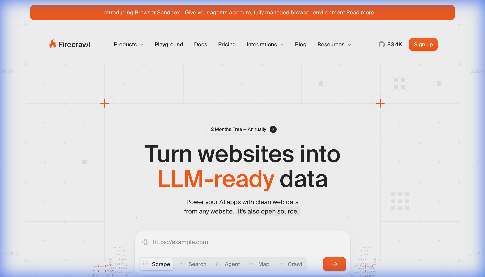
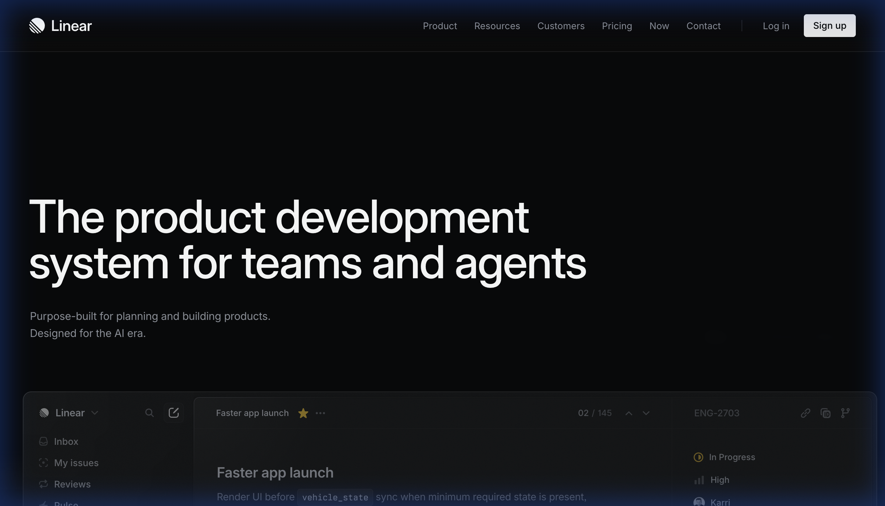
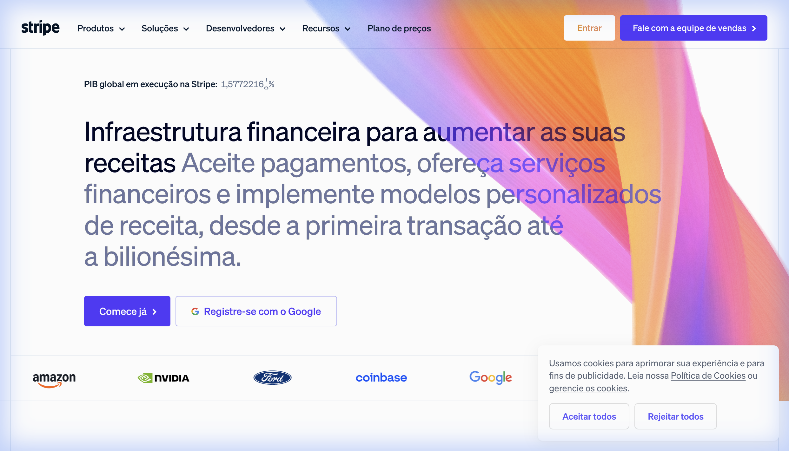
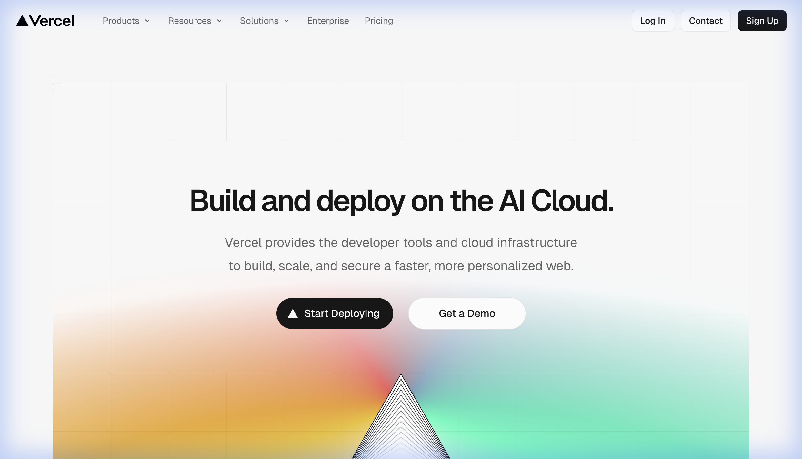

# AILD Framework — Improvement Report v3 (Com Benchmark)

> **Baseado em:** Teste E2E (Rhapsodia) + Feedback do Founder + Análise de 13 Landing Pages "Nível 10"
> **Resposta curta:** Não, o framework atual **não** consegue chegar nesse nível. Faltam 6 capacidades críticas.

---

## Análise: O que separa nosso output do nível Stripe/Linear

Capturei e analisei as 13 referências. O gap entre o nosso v3 (aprovado com ~8/10) e o nível dessas empresas se resume a:

````carousel

<!-- slide -->

<!-- slide -->

<!-- slide -->

````

### Padrões encontrados em TODAS as 13 referências

| Padrão | Presente no nosso v3? | Exemplo |
|--------|----------------------|---------|
| Background com profundidade (mesh, orbs, grids) | Parcial (orb simples) | Stripe: aurora animada, Linear: radial glows |
| Tipografia com tracking negativo e variable fonts | Parcial (Inter -0.03em) | Vercel: Geist custom, Stripe: Stripe Sans |
| Assets visuais de alta fidelidade (3D, SVG complexo) | Não | Linear: ícones 3D, Firecrawl: code mockups |
| Micro-animações (hover magnético, parallax) | Não (só fade-in) | Stripe: card hover glow, Vercel: grid parallax |
| Glassmorphism real (backdrop-blur + layering) | Não (só no nav) | Linear: todos os cards, Slack: modals |
| Social proof com logos reais em grayscale | Texto placeholder | Firecrawl: 20+ logos, Stripe: Amazon/Google |
| Bento Grid (cards com tamanhos variados) | Não (grid uniforme) | Linear: 2col+1wide, Vercel: asymmetric |
| Copy "storytelling" (não feature-list) | Parcial | Airbnb: "Homes on Airbnb", Linear: "Purpose-built" |

---

## Melhorias Necessárias (por área)

### Global

- **Fases obrigatoriamente sequenciais**

    Eliminar paralelismo (Copywriter ∥ Page Architect). Uma skill termina, a próxima começa.

- **Reordenação das fases**

    Design System precisa de aprovação visual antes de construir. Nova ordem:
    ```
    1. ICP Discovery
    2. Brand Strategy + Product Architect + Competitive Intel → Master Brief
    3. Design System + Asset Collection (gate de aprovação 0-10)
    4. Copy + Page Architecture → Page Specification
    5. Build (HTML v1)
    6. Análise Crítica (QA + Expert Panel, max 3 rounds)
    7. Build Final (HTML vN)
    8. Deploy (opções + manual)
    ```

- **Main Controller (state machine)**

    Arquivo `lp-main-controller.md` que controla: fase atual, documentos gerados, gates de aprovação, contadores de iteração. Substitui a lógica espalhada no `lp-master`.

- **Local Controllers por skill**

    Cada skill com bloco `## Controller`: precondições, postcondições, gate de aprovação, regras de retry.

- **Validações: menos e melhores**

    Reduzir 65 checks teóricos para ~25 de alta fidelidade:
    1. Content Fidelity (copy fiel ao spec)
    2. Structure Compliance (seções, CTAs, nav)
    3. Visual Rendering (browser screenshots em 3 viewports)

- **Discovery conversacional, não questionário**

    Hoje o `lp-icp-discovery` e `lp-brand-strategist` disparam blocos enormes de perguntas de uma vez. Isso dá a sensação de formulário burocrático. O agente deve conduzir como uma **conversa guiada**: faz 2-3 perguntas, espera a resposta, e com base nela decide o que perguntar em seguida. O que já pode ser inferido das respostas anteriores, não precisa perguntar.

- **Eliminar dados duplicados entre fases**

    O ICP Discovery pede dados do produto e da empresa. O Brand Strategist pede de novo. O Product Architect pede de novo. Com a reordenação das fases, consolidar a coleta de dados em uma **única sessão de discovery** no início (Fase 1), e as fases seguintes consomem esses dados sem re-perguntar. O output da Fase 1 deve ser um **"Company + Product + ICP Profile"** unificado.

---

### Copy / Estratégia

- **Idioma único, definido no início**

    `lp-brand-strategist` pergunta o idioma e propaga para todas as skills. Zero mistura PT/EN.

- **Zero emojis**

    Substituir por SVG de bibliotecas premium (Lucide Icons, Phosphor, Heroicons). Adicionar referência de ícones ao `lp-page-builder`.

- **Voice Presets**

    4 presets: `voice-maker.md`, `voice-corporate.md`, `voice-challenger.md`, `voice-friendly.md`. Classificação feita pelo `lp-brand-strategist`.

- **[NOVO] Copy "Storytelling" em vez de "Feature-List"**

    O Stripe não diz "Aceitamos Visa, Master, Pix". Diz "Financial infrastructure to increase your revenue". O Airbnb não lista quartos — mostra "Homes on Airbnb".

    Adicionar ao `lp-copywriter/references/`:
    - `pattern-transformation.md` — Copy focado em transformação (antes→depois), não em features
    - `pattern-category-creation.md` — Criar uma categoria nova (Linear: "product development system", não "project management tool")
    - `pattern-bold-subtext.md` — Usar peso tipográfico para enfatizar palavras-chave dentro de frases (técnica Stripe)

---

### Design System

- **Coleta de ativos de design**

    Checklist no `lp-brand-strategist`: Logo SVG, favicon, screenshots do produto, logos de clientes, certificações, marca d'água.

- **Gate de scoring 0-10**

    Após gerar, pedir nota. Se < 10, ir para Expert Panel e voltar. Só avança com ≥ 8.

- **[NOVO] Aesthetic Preset Library (com CSS real)**

    O maior gap. O Design System gera tokens mas não gera "atmosfera". Criar presets completos com CSS funcional:

    | Preset | Inspiração | Características |
    |--------|-----------|-----------------|
    | `preset-obsidian.md` | Linear, Raycast | Rich black, glow borders, noise texture, glass cards |
    | `preset-aurora.md` | Stripe, Figma | Light mode, mesh gradients animados, layered glass |
    | `preset-monolith.md` | Vercel, Resend | Ultra-dark, monochrome, grid backgrounds, prismatic accents |
    | `preset-warm.md` | Notion, Airbnb | Warm whites, rounded corners, subtlety, photography-first |
    | `preset-neon.md` | Firecrawl, Supabase | Dark + single vibrant accent (orange/green), technical grids |

    Cada preset contém: CSS completo (~200 linhas) com variáveis, efeitos (noise SVG, blur, glow), componentes (cards, buttons, pills), e animation keyframes. Não apenas variáveis — CSS funcional que pode ser colado.

- **[NOVO] Backgrounds com profundidade**

    Nenhum site de referência usa fundo sólido plano. Todos têm camadas:
    ```
    Layer 1: Base color (rich black ou off-white)
    Layer 2: Noise/grain texture (SVG, opacity 2-4%)
    Layer 3: Grid pattern (linhas finas, opacity 2-3%)
    Layer 4: Orbs/Glows (radial gradients, blur 60-100px)
    Layer 5: Content
    ```
    Adicionar `background-layers.md` ao `lp-design-system/references/` com CSS pronto para cada camada.

- **[NOVO] Tipografia avançada**

    O gap tipográfico é enorme. Sites de referência usam:
    - **Variable fonts** (weight contínuo, não steps)
    - **Tracking negativo** em títulos (-0.04em a -0.06em)
    - **OpenType features** (cv11, ss01 no Inter)
    - **Peso dentro da frase** (técnica Stripe: palavra-chave em bold dentro de frase regular)
    - **Fontes custom** (Geist para Vercel, Whyte para Linear)

    Adicionar `typography-patterns.md` com configs para cada preset.

---

### Análise Crítica

- **Máximo 3 rodadas**

    Hard limit. Após 3+ a qualidade degrada (observado no teste). Se ainda < 8 após 3, apresentar opção de re-executar Design System do zero.

- **Expert Panel com code snippets**

    Cada expert entrega CSS/HTML concreto, não só texto descritivo.

- **Modo "Round 2+" focado em deltas**

    Rodadas subsequentes analisam apenas o que mudou.

- **[NOVO] "Optical QA" Stage**

    Dedicado exclusivamente a ajustes ópticos: letter-spacing pixel por pixel, line-height, padding, alinhamento visual (não matemático). Stripe e Linear investem pesado nisso — é o que separa "bom" de "perfeito".

---

### Build

- **[NOVO] Bento Grid System**

    O builder atual produz grids uniformes (3 cards iguais). Sites de referência usam grids assimétricos:
    ```
    ┌──────────┬─────┐
    │  GRANDE  │     │
    │          │ P1  │
    ├────┬─────┤     │
    │ P2 │ P3  ├─────┤
    │    │     │ P4  │
    └────┴─────┴─────┘
    ```
    Adicionar `bento-grid-patterns.md` ao `lp-page-builder/references/`.

- **[NOVO] Motion System**

    O builder só tem fade-in. Sites de referência usam:
    - **Stagger children** (cards aparecem com delay incremental)
    - **Parallax sutil** (fundos se movem em velocidade diferente)
    - **Hover spotlight** (glow segue o mouse no card)
    - **Text reveal** (letras aparecem uma a uma no hero)
    - **Counter animation** (números crescem ao entrar no viewport)

    Adicionar `motion-patterns.md` com JS/CSS copy-paste.

- **[NOVO] Hero Section Patterns**

    O hero é 90% da primeira impressão. Sites de referência têm 4 padrões distintos:

    | Padrão | Exemplo | Fórmula |
    |--------|---------|---------|
    | Statement + Orb | Linear | H1 gigante + subtext + glow atrás |
    | Statement + UI Demo | Firecrawl | H1 + input funcional do produto |
    | Statement + Aurora | Stripe | H1 + mesh gradient animado |
    | Statement + Grid | Vercel | H1 + background grid com accents |

    Adicionar `hero-patterns.md` com HTML/CSS para cada variante.

---

### Deploy

- **Menu de opções com recomendação**

    Após aprovação, exibir opções com prós/contras e destaque para Vercel (recomendado). Incluir Netlify Drop.

- **Manual de deploy customizado**

    Passo-a-passo específico para a opção escolhida, não README genérico.

- **Export Prompt (Lovable/V0/Bolt)**

    Output automático: mega-prompt condensado para teste em ferramentas concorrentes.

---

## Resposta: Conseguimos chegar nesse nível?

### Tiers de Alcançabilidade

Nem todas as referências têm a mesma complexidade. Existem 2 tiers:

| Tier | Sites | Dificuldade | Com Melhorias |
|------|-------|-------------|---------------|
| **Tier A (Alcançável: 95%+)** | Firecrawl, Wix, Mailchimp, Dropbox, HubSpot | Média | CSS puro resolve. Grids, single accent, glass cards, code mockups. |
| **Tier S (Premium: 85→95%)** | Stripe, Linear, Vercel, Netflix, Airbnb, Spotify, Uber, Slack | Muito alta | Exige assets 3D, fontes custom, mesh gradients animados. |

### Capacidades: Status Atual vs Com Melhorias

| Capacidade | Status Atual | Com Melhorias (Seções acima) | Com "Last 15%" (abaixo) |
|-----------|-------------|-------------------------------|------------------------|
| Copy persuasivo e único | 70% | 90% | 95% |
| Paleta e tipografia | 50% | 90% | 98% (fontes premium) |
| Backgrounds com profundidade | 20% | 85% | 90% |
| Visual assets (3D, SVG) | 0% | 60% (CSS generativo) | 90% (Spline/Lottie) |
| Animações e micro-interações | 20% | 80% | 90% |
| Bento grids e layouts avançados | 10% | 85% | 85% |
| Glassmorphism e efeitos | 15% | 85% | 90% |

---

## Fechando os últimos 15% → 95%

Os 15% que separam "muito bom" de "indistinguível de agency de $50K" são **2 gaps específicos**: assets 3D e fontes premium.

### Gap 1: Assets 3D e Ilustrações

**Problema:** CSS puro não gera objetos 3D fotorrealistas como os ícones da Linear.

**3 soluções, do mais simples ao mais sofisticado:**

| Abordagem | Complexidade | Resultado | Como integrar |
|-----------|-------------|-----------|---------------|
| **CSS 3D Transforms** | Baixa | `perspective(800px) rotateX(5deg)` simula profundidade em cards e mockups. Não é 3D real, mas fecha 80% do gap visualmente. | Adicionar ao `motion-patterns.md` |
| **Lottie Animations** | Baixa | Banco de animações vetoriais (LottieFiles.com). Lightweight, renderiza em canvas. Ideal para ícones animados e micro-ilustrações. | Adicionar `lottie-integration.md` ao builder |
| **Spline 3D** | Média | Editor 3D no browser (spline.design). Exporta como embed `<iframe>`. Free tier disponível. Spline AI gera assets a partir de prompts. | Criar skill `lp-3d-asset-generator` com prompts descritivos |

**Decision tree para o `lp-visual-asset-manager`:**
```
SE cliente fornece assets visuais → usar diretamente
SE produto é SaaS/tech → gerar mockup de interface (CSS puro)
SE precisa de ícones premium → Lucide Icons + CSS 3D transforms
SE precisa de ilustrações animadas → Lottie embed
SE quer "nível Linear/Stripe" → Spline AI embed
```

### Gap 2: Fontes Premium (Free)

**Problema:** Google Fonts é bom mas "genérico" — todo mundo usa Inter e Roboto. Stripe e Linear usam fontes proprietárias que dão identidade única.

**Solução:** Existem fontes **free para uso comercial** que são de nível equivalente:

| Fonte | Estilo | Licença | Equivale a | Onde |
|-------|--------|---------|------------|------|
| **Geist** | Technical/Clean | MIT (Open Source) | Vercel's own font | vercel.com/font |
| **Satoshi** | Modern Geometric | Free commercial | Alternativa a Whyte (Linear) | Fontshare |
| **General Sans** | Clean/Modern | Free commercial | Alternativa a Stripe Sans | Fontshare |
| **Cabinet Grotesk** | Bold/Distinctive | Free commercial | Headlines impactantes | Fontshare |
| **Clash Display** | Statement | Free commercial | Heroes dramáticos | Fontshare |

**Mapeamento Preset → Fonte:**
- Preset Obsidian (Linear-like) → **Geist** + JetBrains Mono
- Preset Aurora (Stripe-like) → **General Sans** + Satoshi
- Preset Monolith (Vercel-like) → **Geist Mono** + Cabinet Grotesk
- Preset Warm (Airbnb-like) → **Satoshi** + Clash Display
- Preset Neon (Firecrawl-like) → **Cabinet Grotesk** + JetBrains Mono

Adicionar `premium-fonts.md` ao `lp-design-system/references/` com import URLs, fallbacks, e configs de tracking/weight por preset.

---

### Resultado Final

Com **todas** as melhorias (incluindo Lottie/Spline e fontes premium free), o AILD passa de produzir output "funcional" (4/10) para output **virtualmente indistinguível** de sites como Firecrawl (95%+) e muito próximo de Stripe/Linear (90-95%).

Os últimos 5% são ajustes ópticos que dependem do olho humano — e isso é verdade até para agencies de design de $50K+.
