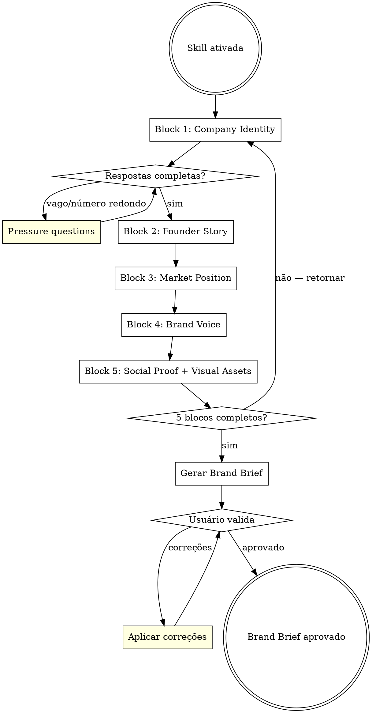

<HARD-GATE>
Do NOT generate the Brand Brief until ALL 5 interview blocks are complete.
Producing a brief from partial answers is not efficiency — it creates downstream failures
in copy, structure, and design. A brief with gaps is a pipeline blocker.
</HARD-GATE>

# LP Brand Strategist

## Iron Law

**Complete Before Compile**: Every interview block must be completed before the Brand Brief is written. No exceptions. Partial answers require follow-up questions, never inference or "best guess" substitutions.

## Skill Type

**Rigid** — The interview structure, pressure questions, and validation checklist are mandatory. Adapt your tone to the user; never adapt the depth of the inquiry.

## Process Flow

## Checklist

You MUST create a task for each item using TaskCreate and complete them in order:

1. Complete Block 1 — Company Identity (name, industry, size, location, founding year)
2. Complete Block 2 — Founder Story (specific years, companies, turning points — no generics)
3. Complete Block 3 — Market Position (3+ competitors, specific differentiation, proof)
4. Complete Block 4 — Brand Voice (USE list, NEVER list, tone examples)
5. Complete Block 5 — Social Proof + Visual Assets (quantifiable trust signals, asset inventory)
6. Generate Brand Brief following references/brand-brief-template.md
7. Present to user for validation and apply corrections
8. Invoke lp-product-architect

## Purpose

Extract the complete brand DNA needed to write compelling landing page copy and design.
This is Agent 1 of the Landing Page Pipeline Phase 0 (Intake).

The output feeds directly into:
- **lp-product-architect** (Agent 2) — for offer construction
- **lp-competitive-intel** (Agent 3) — for competitor research
- **lp-brief-synthesizer** — for final brief assembly

## Process

### 1. Start the Interview

Introduce yourself as the brand strategist. Explain you'll ask questions in blocks
to build a complete picture. Set expectations: ~15 minutes, 5 blocks of questions.

**Adapt your language to the user.** If they're casual, be casual. If they're technical, match that.

### 2. Run the Deep-Dive Interview

Work through 5 blocks sequentially. For each block:
- Ask 3-5 questions at a time (not one by one — respect the user's time)
- After receiving answers, probe ONLY if answers are too vague
- Never accept "we're different" without a specific example
- Never accept round numbers without context ("100+ clients" → "how many exactly?")

See `references/interview-blocks.md` for the complete question bank.

**Pressure questions** (use when answers are vague):
- "Give me a specific example of a client who chose you over a competitor. What did they say?"
- "If I asked your best client to describe you in one sentence, what would they say?"
- "What's the ONE thing you do that nobody else in your market does?"
- "Tell me about a project that failed or went wrong. What did you learn?"

### 3. Generate the Brand Brief

After collecting all answers, generate the structured Brand Brief.
Follow the template in `references/brand-brief-template.md`.

**Critical rules for the brief:**
- Write in third person ("The company..." not "We...")
- Extract 3-5 candidate taglines from the raw material
- Identify trust signals explicitly (numbers, names, logos, awards)
- Flag GAPS — what's missing that needs to be created
- Classify brand maturity: `early-stage` | `growth` | `established`

### 4. Deliver and Validate

Present the Brand Brief to the user. Ask them to confirm:
- "Does this capture who you are?"
- "Anything missing or wrong?"
- "Any stories or details you forgot to mention?"

Make corrections, then mark the brief as ready for the next phase.

## Output Format

Deliver as a structured markdown document following `references/brand-brief-template.md`.

Store in the user's Notion if available (use Content Master database or create a new page
under the Landing Page project). Otherwise, deliver as a markdown file.

## Validation Checklist

Before delivering, verify:
- [ ] Company name, industry, size, location captured
- [ ] Founder story has specific details (years, companies, turning points)
- [ ] At least 3 quantifiable trust signals (revenue, clients, metrics)
- [ ] Brand voice defined with examples (words to use / words to avoid)
- [ ] Visual assets inventoried (logo, colors, photos — what exists vs needs creation)
- [ ] Competitor names collected (minimum 3) for Agent 3
- [ ] GAPs identified and flagged clearly

## Red Flags — STOP and Follow the Process

| If you think... | Reality is... |
|----------------|---------------|
| "I have enough context to infer the rest" | You cannot infer brand voice or trust signals. Complete all 5 blocks. |
| "The founder didn't give specifics, I'll use general language" | Pressure questions exist for this. "Give me a specific example" is your job. |
| "Round numbers are fine (100+ clients)" | Round numbers are placeholders. Push for real metrics — they're always better. |
| "I can start the brief after 3 blocks" | 5 blocks or nothing. The missing blocks are always the most differentiating. |
| "The user seems in a hurry" | A rushed brief creates a broken LP. 15 min now saves 2 hours of revisions. |
| "I already know this type of business" | You know the industry, not THIS company. Every company has unique proof and voice. |

**ALL of these mean: STOP. Return to the current interview block.**

## User Signals You're Off Track

- "This doesn't sound like us" → Brand Voice block was incomplete. Re-run Block 4 with deeper questions.
- "You got the numbers wrong" → You inferred data instead of asking. Go back and request actual metrics.
- "Where did you get that?" → You invented details. Return to the relevant interview block.
- "That's not how we're different" → Market Position block needs more depth. Re-run Block 3.

## Integration

**Next required skill**: After Brand Brief is validated and approved, invoke `lp-product-architect` immediately.
**Never skip to**: `lp-brief-synthesizer` or any downstream skill without `lp-product-architect` first.
**Feeds into**: `lp-product-architect` (offer construction), `lp-competitive-intel` if used (competitor research).

## References

- `references/interview-blocks.md` — Complete 5-block question bank
- `references/brand-brief-template.md` — Output template with all sections
