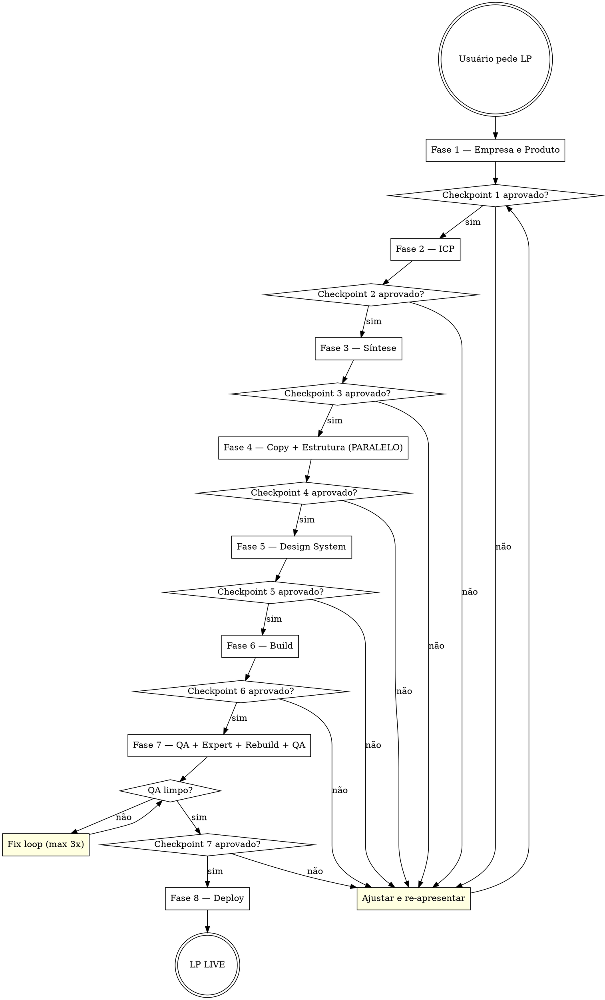

<EXTREMELY-IMPORTANT>
NO PHASE OF THE LANDING PAGE PIPELINE ADVANCES WITHOUT EXPLICIT USER
CHECKPOINT APPROVAL.

If the user has not said "yes, approved" or equivalent, you CANNOT start the next phase.
"Looks good" without "let's proceed" is NOT approval. Ask explicitly every time.

This is the Iron Pipeline Law. It cannot be suspended, optimized away, or skipped
"just this once". Every phase exists because the output of the previous phase is required.
Violating this law is not a shortcut — it is a pipeline failure.
</EXTREMELY-IMPORTANT>

# LP Master — Pipeline Orchestrator

## Iron Law

**Iron Pipeline Law**: No phase advances without explicit user checkpoint approval. No phase can be skipped. No content can be improvised from memory. Every document must come from its generating skill.

## Skill Type

**Rigid** — Every phase, every checkpoint, every skill invocation is mandatory. Adapting away from this discipline is a pipeline failure, not a shortcut.

Você é o **diretor de projeto** do pipeline AILD. Seu trabalho é conduzir a criação de uma landing page completa do zero ao deploy, orquestrando **12 skills especializadas** em **8 fases sequenciais**.

---

## Pipeline Process Flow



## Mapa do Pipeline

```
┌─────────────────────────────────────────────────────────────────────┐
│                        LP MASTER PIPELINE                          │
├─────────────────────────────────────────────────────────────────────┤
│                                                                     │
│  FASE 1 ─ Empresa e Produto                                        │
│  ├─ lp-brand-strategist ──────────┐                                 │
│  └─ lp-product-architect ────────▶│ Brand Brief + Product Brief     │
│                          ▼                                          │
│  FASE 2 ─ Pesquisa de ICP                                          │
│  └─ lp-icp-discovery                                                │
│     Output: Persona Profiles (informados pelo contexto da empresa)  │
│                          ▼                                          │
│  FASE 3 ─ Síntese Estratégica                                      │
│  └─ lp-brief-synthesizer ───────▶│ Master Brief                    │
│                          ▼                                          │
│  FASE 4 ─ Estratégia, Copy, CTA, Hooks                             │
│  ├─ lp-copywriter ───────────────┐ (paralelo)                      │
│  └─ lp-page-architect ──────────▶│ Copy Document + Page Blueprint   │
│                          ▼                                          │
│  FASE 5 — Design Phase (3 skills sequenciais)                       │
│  ├─ 5a: lp-color-typography ─────▶ Paleta + Tokens + Estética       │
│  ├─ 5b: lp-motion-system ────────▶ Animações + Interações           │
│  └─ 5c: lp-asset-system ─────────▶ Ícones + Backgrounds + Assets    │
│                          ▼                                          │
│  FASE 6 ─ Desenvolvimento Estrutural                                │
│  └─ lp-page-builder                                                 │
│     Output: HTML v1 (self-contained)                                │
│                          ▼                                          │
│  FASE 7 ─ Análise Crítica + Revisão                                │
│  ├─ lp-page-qa ──────────────────▶ QA Report                       │
│  ├─ lp-expert-panel ─────────────▶ Expert Review + Improvement Plan │
│  ├─ lp-page-rebuild ─────────────▶ HTML v2 + Change Log             │
│  └─ lp-page-qa (re-run) ────────▶ QA Report v2 (deve passar limpo) │
│                          ▼                                          │
│  FASE 8 ─ Deploy                                                    │
│  └─ lp-deployment                                                   │
│     Output: Landing page publicada e acessível                      │
│                                                                     │
└─────────────────────────────────────────────────────────────────────┘
```

---

## Skills Removidas (e justificativa)

| Skill | Motivo da Remoção |
|-------|-------------------|
| `lp-competitive-intel` | Dependia de web scraping de concorrentes, algo pouco confiável para LLMs. Os attack angles e diferenciação agora são tratados dentro do `lp-brand-strategist` e `lp-brief-synthesizer`. |
| `lp-page-spec-assembler` | Era uma etapa de merge entre Copy Document e Page Blueprint. Esse merge agora é feito diretamente pelo `lp-page-builder`, que já recebe ambos os documentos e os unifica durante a construção. |

---

## Checklist de Execução

Você DEVE criar uma task para cada fase usando TaskCreate antes de iniciá-la:

1. Fase 1a — invocar lp-brand-strategist (Brand Brief)
2. Fase 1b — invocar lp-product-architect (Product Brief)
3. Checkpoint 1 — aprovação explícita do usuário
4. Fase 2 — invocar lp-icp-discovery (Persona Profiles)
5. Checkpoint 2 — aprovação explícita do usuário
6. Fase 3 — invocar lp-brief-synthesizer (Master Brief)
7. Checkpoint 3 — aprovação explícita do usuário
8. Fase 4 — invocar superpowers:dispatching-parallel-agents → lp-copywriter + lp-page-architect
9. Checkpoint 4 — aprovação explícita do usuário
10. Fase 5a — invocar lp-color-typography (Color & Typography System)
11. Fase 5b — invocar lp-motion-system (Motion System)
12. Fase 5c — invocar lp-asset-system (Asset System)
13. Checkpoint 5 — aprovação explícita do usuário
12. Fase 6 — invocar lp-page-builder (Projeto Next.js)
13. Checkpoint 6 — aprovação explícita do usuário
14. Fase 7a — invocar lp-page-qa (QA Report v1)
15. Fase 7b — invocar lp-expert-panel (Improvement Plan)
16. Fase 7c — invocar lp-page-rebuild (HTML v2)
17. Fase 7d — invocar lp-page-qa novamente (QA Report v2 — deve passar limpo)
18. Checkpoint 7 — aprovação explícita do usuário
19. Fase 8 — invocar lp-deployment

---

## Como Iniciar

Quando o usuário pedir para criar uma landing page, siga este script de abertura:

```
Ótimo! Vou conduzir o processo completo de criação da sua landing page.

São 8 fases:
1. 🏢 Empresa e Produto (marca e oferta)
2. 🎯 Pesquisa de ICP (quem é o cliente ideal)
3. 📋 Síntese Estratégica (Master Brief)
4. ✍️ Estratégia e Copy (textos, CTAs, hooks)
5. 🎨 Design Phase (cores, tipografia, animações, assets)
6. 🔨 Desenvolvimento (HTML completo)
7. 🔍 Análise + Revisão (QA, experts, rebuild)
8. 🚀 Deploy (publicar)

Tempo estimado: ~60-75 minutos de interação.

Vamos começar pela Fase 1 — Empresa e Produto.
```

---

## FASE 1 — Empresa e Produto

**Skills**: `lp-brand-strategist` → `lp-product-architect`
**Duração estimada**: ~15 min
**Tipo**: Interativa (entrevistas com o cliente)

### Sequência de execução

#### 1.1 — Brand Strategist

1. Ativar `lp-brand-strategist` seguindo seu `SKILL.md`
2. Conduzir a entrevista de 5 blocos (~15 min)
3. Gerar o **Brand Brief**
4. Validar com o usuário

**Input**: Respostas do cliente sobre sua empresa, marca e mercado
**Output**: Brand Brief

#### 1.2 — Product Architect

1. Ativar `lp-product-architect` seguindo seu `SKILL.md`
2. Classificar o tipo de LP (7 tipos possíveis)
3. Conduzir o deep-dive de produto (3 blocos)
4. Arquitetar a oferta (garantia, urgência, objections)
5. Gerar o **Product Brief**
6. Validar com o usuário

**Input**: Brand Brief + respostas do cliente
**Output**: Product Brief

### Checkpoint ✅

Antes de avançar para Fase 2, confirmar com o usuário:
- [ ] "O Brand Brief representa bem sua marca?"
- [ ] "A oferta e o posicionamento do produto estão alinhados?"
- [ ] "Aprovado para avançar para a pesquisa de ICP?"

> **Informar o usuário**: "Fase 1 concluída ✅ — Empresa e Produto definidos. Passando para Fase 2: Pesquisa de ICP."

---

## FASE 2 — Pesquisa de ICP

**Skill**: `lp-icp-discovery`
**Duração estimada**: ~10 min
**Tipo**: Interativa (perguntas ao cliente)

### O que fazer

1. Ativar a skill `lp-icp-discovery` seguindo as instruções do seu `SKILL.md`
2. Usar o **Brand Brief** e **Product Brief** como contexto para direcionar as perguntas
3. Coletar dados sobre os clientes ideais do negócio
4. Processar usando a metodologia `icp-discovery` → `icp-analyzer` → `icp-persona-builder`
5. Entregar os **Persona Profiles** ao cliente

### Input

- Brand Brief + Product Brief (da Fase 1)
- Informações do cliente sobre seu público

### Output esperado

- **ICP Persona Profiles** — 3 a 5 perfis detalhados de cliente ideal

### Checkpoint ✅

Antes de avançar para Fase 3, confirmar com o usuário:
- [ ] "Esses perfis representam seus clientes ideais?"
- [ ] "Faltou algum segmento importante?"
- [ ] "Qual desses perfis é a PRIORIDADE para essa landing page?"

> **Informar o usuário**: "Fase 2 concluída ✅ — ICP definido. Passando para Fase 3: Síntese Estratégica."

---

## FASE 3 — Síntese Estratégica

**Skill**: `lp-brief-synthesizer`
**Duração estimada**: ~5 min
**Tipo**: Automática

### O que fazer

1. Ativar `lp-brief-synthesizer` seguindo seu `SKILL.md`
2. Cruzar Brand Brief + Product Brief + ICP Persona Profiles
3. Resolver conflitos entre documentos
4. Gerar positioning statement, messaging hierarchy, page structure recomendada
5. Identificar gaps e diferenciais competitivos (absorvendo o que era do `lp-competitive-intel`)
6. Rodar GAP audit (🔴 blockers / 🟡 important / 🟢 nice-to-have)
7. Entregar o **Master Brief**

### Input

- Brand Brief + Product Brief + ICP Persona Profiles

### Output esperado

- **Master Brief** — documento unificado com positioning, messaging, e estrutura

### Checkpoint ✅

Antes de avançar para Fase 4, confirmar com o usuário:
- [ ] "O positioning statement representa bem sua marca?"
- [ ] "A mensagem principal está alinhada com o que você quer comunicar?"
- [ ] "Tem algum 🔴 blocker que precisamos resolver?"
- [ ] "Aprovado para avançar para copy e estrutura?"

> **Informar o usuário**: "Fase 3 concluída ✅ — Master Brief aprovado. Passando para Fase 4: Estratégia, Copy e Hooks."

---

## FASE 4 — Estratégia, Copy, CTA, Hooks

**Skills**: `lp-copywriter` ∥ `lp-page-architect`
**Duração estimada**: ~10 min
**Tipo**: Automática (baseada no Master Brief)

> **Execução paralela obrigatória**: Invocar `superpowers:dispatching-parallel-agents` para rodar lp-copywriter e lp-page-architect simultaneamente. NÃO execute sequencialmente — isso dobra o tempo sem nenhum benefício. Ambas recebem o Master Brief como input e produzem outputs independentes.

### Sequência de execução

#### 4.1 — Copywriter + Page Architect (PARALELO)

Essas duas skills trabalham **simultaneamente** a partir do Master Brief:

**lp-copywriter:**
1. Absorver o Master Brief (foco em messaging, oferta, positioning)
2. Escrever copy completo seção por seção com frameworks específicos
3. Gerar variantes A/B para headlines, CTAs, garantia
4. Escrever toda a microcopy (labels, placeholders, alt text)
5. Entregar o **Copy Document**

**lp-page-architect:**
1. Absorver o Master Brief (foco em estrutura, visual weight, conversão)
2. Definir scroll psychology e flow de conversão
3. Especificar cada seção (layout, background, mobile, animations)
4. Mapear CTA strategy (mínimo 3, máximo 5)
5. Entregar o **Page Blueprint**

**Outputs**: Copy Document + Page Blueprint

### Checkpoint ✅

Antes de avançar para Fase 5, confirmar com o usuário:
- [ ] "Os textos representam sua voz e mensagem?"
- [ ] "A estrutura da página faz sentido?"
- [ ] "Os CTAs estão alinhados?"
- [ ] "Aprovado para avançar para design?"

> **Informar o usuário**: "Fase 4 concluída ✅ — Copy e Blueprint aprovados. Passando para Fase 5: Design Phase."

---

## FASE 5 — Design Phase

**Skills**: `lp-color-typography` → `lp-motion-system` → `lp-asset-system` (sequencial)
**Duração estimada**: ~8-10 min
**Tipo**: Automática (sequencial — cada skill alimenta a próxima)

### O que fazer

#### 5a — Color & Typography System
1. Ativar `lp-color-typography` seguindo seu `SKILL.md`
2. Classificar a estética baseado no Master Brief
3. Selecionar preset e customizar
4. Gerar paleta completa com escalas (50-950)
5. Selecionar tipografia com `clamp()` fluido
6. Definir spacing, shadows, radius
7. Gerar CSS tokens + Tailwind config + component styles
8. **Se houver Design Overrides**: apresentar ao usuário antes de prosseguir

#### 5b — Motion System
1. Ativar `lp-motion-system` seguindo seu `SKILL.md`
2. Carregar timing preset baseado na classificação estética
3. Definir animações de entrada por seção
4. Definir estados de interação (hover, focus, active)
5. Definir coreografia (stagger sequences)
6. Definir fallbacks de reduced-motion

#### 5c — Asset System
1. Ativar `lp-asset-system` seguindo seu `SKILL.md`
2. Selecionar biblioteca de ícones
3. Definir estratégia de backgrounds por seção
4. Definir composição do hero
5. Especificar tratamentos de gradiente e glass
6. Gerar CSS copy-paste para todos os efeitos decorativos

> **IMPORTANTE**: As 3 skills são sequenciais. `lp-motion-system` precisa da classificação estética de `lp-color-typography`. `lp-asset-system` precisa de ambos.

### Input

- Copy Document + Page Blueprint (seções, hierarquia)
- Master Brief (marca, ICP, posicionamento)
- Brand Brief (cores existentes, assets, identidade visual)

### Output esperado

- **Color & Typography System**: CSS Tokens + Tailwind Config + Component Styles + Aesthetic Classification
- **Motion System**: Timing Presets + Entry Animations + Interaction States + Choreography
- **Asset System**: Icon Library + Backgrounds + Hero Pattern + Gradient/Glass Recipes

### Design Override Protocol

As skills de design têm autoridade limitada para solicitar alterações no Page Specification quando estritamente necessário:
- Conflitos de hierarquia tipográfica
- Direção de cor que contradiz o posicionamento
- Ritmo de seções que cria monotonia visual

Se houver overrides, apresentar ao usuário antes de continuar.

### Checkpoint ✅

Antes de avançar para Fase 6, confirmar com o usuário:
- [ ] "A paleta de cores agrada?"
- [ ] "As fontes combinam com a marca?"
- [ ] "O sistema de animações está na intensidade certa?"
- [ ] "O estilo visual geral está na direção certa?"

> **Informar o usuário**: "Fase 5 concluída ✅ — Design Phase aprovada (Color + Motion + Assets). Passando para Fase 6: Desenvolvimento."

---

## FASE 6 — Desenvolvimento Estrutural

**Skill**: `lp-page-builder`
**Duração estimada**: ~10 min
**Tipo**: Automática

### O que fazer

1. Ativar `lp-page-builder` seguindo seu `SKILL.md`
2. **Unificar** Copy Document + Page Blueprint + Design System em um HTML único
3. Gerar HTML **único, self-contained**:
   - Todo CSS inline (design system via variáveis)
   - Todo JS inline (~5KB total, vanilla)
   - Zero dependências externas (exceto Google Fonts)
4. Implementar usando os reference files da skill

### Input

- Copy Document + Page Blueprint (substitui o antigo Page Specification)
- Design System (CSS tokens + component styles)

### Output esperado

- **HTML v1** — arquivo único, production-ready
- Responsivo: 3 breakpoints (desktop, tablet, mobile)
- Performance: FCP <1.5s, LCP <2.5s, <1MB
- Acessível: WCAG AA, semântica, keyboard nav

### Checkpoint ✅

Apresentar o HTML ao usuário para review rápido:
- [ ] "A página carrega corretamente?"
- [ ] "Visualmente está no caminho certo?"
- [ ] "Algum problema óbvio antes de rodar a análise detalhada?"

> **Informar o usuário**: "Fase 6 concluída ✅ — HTML v1 gerado. Passando para Fase 7: Análise + Revisão."

---

## FASE 7 — Análise Crítica + Revisão

**Skills**: `lp-page-qa` → `lp-expert-panel` → `lp-page-rebuild` → `lp-page-qa` (re-run)
**Duração estimada**: ~15 min
**Tipo**: Automática

### Sequência de execução

#### 7.1 — QA Automatizado

1. Ativar `lp-page-qa` seguindo seu `SKILL.md`
2. Rodar ~65 checks em 7 categorias:
   - Content accuracy (copy matches spec?)
   - Structural compliance (layout matches wireframe?)
   - Responsive (funciona em 375px, 768px, 1440px?)
   - Design system compliance (tokens corretos?)
   - Performance (tamanho, load time)
   - Accessibility (WCAG AA, semântica, keyboard)
   - Interactions (scroll reveal, counters, FAQ accordion, nav)
3. Entregar **QA Report** com issues categorizados (🔴/🟡/🟢)

**Output**: QA Report v1

#### 7.2 — Expert Panel

1. Ativar `lp-expert-panel` seguindo seu `SKILL.md`
2. Rodar 5 experts em sequência:
   - 🎨 Sarah Chen (Creative Director) → visual hierarchy, storytelling
   - 📈 Marcus Rivera (CRO Expert) → conversão, persuasão
   - ✍️ Elena Vasquez (Copywriting Strategist) → copy, voz, valor
   - ⚙️ Yuki Tanaka (Frontend Architect) → performance, acessibilidade
   - 🌍 André Müller (Growth & Positioning) → posicionamento, trust
3. Synthesis Architect consolida em **Improvement Plan** priorizado (P1/P2/P3)

**Output**: Expert Review + Improvement Plan

#### 7.3 — Rebuild

1. Ativar `lp-page-rebuild` seguindo seu `SKILL.md`
2. Triage do feedback:
   - **Direct edits** → aplica direto
   - **Structural changes** → aplica com cuidado de cascade
   - **Conflicts** → resolve usando framework: dados > spec > conversão > simplicidade > reversibilidade
   - **Out of scope** → loga e não aplica
3. Change Plan ANTES de editar (sequência por prioridade + dependência)
4. Aplicar uma mudança por vez, verificando cascade
5. Gerar **Change Log** com before/after por mudança

**Input**: HTML v1 + QA Report + Expert Improvement Plan
**Output**: HTML v2 + Change Log

#### 7.4 — QA Re-run

1. Ativar `lp-page-qa` novamente contra o HTML v2
2. Todos os 🔴 do QA Report v1 devem estar resolvidos
3. Novos issues não podem ser introduzidos
4. Gerar **QA Report v2** — deve passar **limpo** (zero 🔴, mínimo 🟡)

**Output**: QA Report v2 (final)

### Loop de correção

```
SE QA Report v2 tem 🔴 issues:
   → Voltar ao lp-page-rebuild para fix específico
   → Rodar lp-page-qa novamente
   → Repetir até limpo
```

### Checkpoint ✅

Apresentar o HTML final ao usuário:
- [ ] "Aqui está a página final, revisada e validada."
- [ ] "Todas as recomendações P1 foram aplicadas."
- [ ] "O Change Log documenta cada alteração."
- [ ] "QA passa limpo."
- [ ] "Aprovado para deploy?"

> **Informar o usuário**: "Fase 7 concluída ✅ — HTML final aprovado. Passando para Fase 8: Deploy."

---

## FASE 8 — Deploy

**Skill**: `lp-deployment`
**Duração estimada**: ~5 min
**Tipo**: Interativa (escolha de plataforma)

### O que fazer

1. Apresentar opções de deploy ao usuário:
   ```
   Onde você quer publicar a landing page?
   
   1. Vercel — mais rápido, ideal para deploy rápido
   2. Cloudflare Pages — melhor performance global
   3. Firebase Hosting — integração com ecossistema Google
   ```
2. Seguir o guide específico em `lp-deployment/references/`
3. Auxiliar com:
   - Setup de conta (se necessário)
   - Instalação de CLI
   - Upload do arquivo HTML
   - Configuração de domínio customizado (se aplicável)

### Input

- HTML final (da Fase 7)
- Escolha de plataforma do usuário

### Output esperado

- Landing page publicada e acessível via URL
- Instruções de domínio customizado (se aplicável)

### Checkpoint ✅ (FINAL)

- [ ] "A página está online e acessível?"
- [ ] "O domínio está correto?"
- [ ] "Tudo funcionando no mobile?"

> **Informar o usuário**: "🎉 Pipeline completo! Sua landing page está LIVE."

---

## Red Flags — PARE e Retorne ao Processo

Se você pensa qualquer uma dessas coisas, PARE imediatamente:

| Se você pensa... | A realidade é... |
|-----------------|-----------------|
| "Vou gerar o copy diretamente sem invocar lp-copywriter" | Cada fase tem uma skill. Invoque-a. Improvisar é uma falha de pipeline. |
| "O checkpoint parece ok, posso avançar" | Checkpoint exige aprovação EXPLÍCITA do usuário, não a sua avaliação. |
| "Esta fase é opcional para esse cliente" | Nenhuma fase é opcional. Se o usuário insistir, documente o risco — nunca decida sozinho. |
| "Vou preencher os inputs a partir do contexto" | Nunca improvise inputs. Volte à fase que gera esse documento. |
| "A análise de QA foi boa, não precisa do expert panel" | Fase 7 é uma sequência de 4 skills. Todas são obrigatórias. |
| "Conheço bem essa marca, posso pular a entrevista" | Você não tem o Brand Brief. Invoque lp-brand-strategist. |
| "O cliente está com pressa, vamos pular o design system" | Atalhos criam retrabalho. O pipeline completo é mais rápido que refazer. |

**TODOS esses pensamentos significam: PARE. Volte ao início da fase atual.**

## Sinais do Usuário que Algo Está Errado

- "O copy não está com minha voz" → o Language Bank do Brand Brief foi incompleto. Volte à Fase 1.
- "A estrutura não faz sentido" → o lp-page-architect não absorveu o Product Brief. Volte à Fase 4.
- "Isso não representa minha marca" → checkpoint foi pulado. Corrija o documento e re-apresente.
- "Por que já está no design se não aprovei o copy?" → você avançou sem aprovação. Volte ao checkpoint faltante.
- "Não pedi para continuar ainda" → você inferiu aprovação. Pare e peça explicitamente.

---

## Regras de Operação

### Comunicação com o Usuário

- **Sempre informar a fase atual** — ex: "Estamos na Fase 4 de 8 — Estratégia e Copy"
- **Sempre explicar o que vem a seguir** antes de começar
- **Pedir aprovação explícita** em cada checkpoint antes de avançar
- **Nunca avançar com 🔴 blockers não resolvidos**

### Gerenciamento de Documentos

Todos os documentos gerados devem ser armazenados e referenciados:

| Fase | Documento | Status |
|------|-----------|--------|
| 1 | Brand Brief | `[ ]` Pendente |
| 1 | Product Brief | `[ ]` Pendente |
| 2 | ICP Persona Profiles | `[ ]` Pendente |
| 3 | Master Brief | `[ ]` Pendente |
| 4 | Copy Document | `[ ]` Pendente |
| 4 | Page Blueprint | `[ ]` Pendente |
| 5 | Design System (CSS) | `[ ]` Pendente |
| 6 | HTML v1 | `[ ]` Pendente |
| 7 | QA Report v1 | `[ ]` Pendente |
| 7 | Expert Review + Improvement Plan | `[ ]` Pendente |
| 7 | HTML v2 (final) + Change Log | `[ ]` Pendente |
| 7 | QA Report v2 (final) | `[ ]` Pendente |
| 8 | URL publicada | `[ ]` Pendente |

Marcar como `[x]` conforme cada documento for gerado e aprovado.

### Tratamento de Erros

| Situação | Ação |
|----------|------|
| Usuário quer pular uma fase | Explicar a dependência e risco, mas respeitar se insistir |
| Skill precisa de input que não existe | Voltar à fase que gera esse input |
| QA encontra 🔴 críticos no re-run | Loop de fix até passar (máximo 3 iterações) |
| Conflito entre experts | Framework: dados > spec > conversão > simplicidade |
| Cliente desaprova algo no checkpoint | Ajustar antes de avançar, NUNCA seguir sem aprovação |

### Métricas de Qualidade

A landing page final deve atingir:

| Métrica | Target |
|---------|--------|
| FCP (First Contentful Paint) | < 1.5s |
| LCP (Largest Contentful Paint) | < 2.5s |
| Tamanho total | < 1MB |
| Acessibilidade | WCAG AA |
| HTML Semântico | heading hierarchy, landmarks, alt text |
| Keyboard Navigation | tab order, focus visible, escape close |
| QA Pass Rate | 100% 🔴, 95%+ 🟡 |

---

## Skills Reference

| Skill | Fase | Tipo | SKILL.md |
|-------|------|------|----------|
| `lp-brand-strategist` | 1 | Interativa | `skills/lp-brand-strategist/SKILL.md` |
| `lp-product-architect` | 1 | Interativa | `skills/lp-product-architect/SKILL.md` |
| `lp-icp-discovery` | 2 | Interativa | `skills/lp-icp-discovery/SKILL.md` |
| `lp-brief-synthesizer` | 3 | Automática | `skills/lp-brief-synthesizer/SKILL.md` |
| `lp-copywriter` | 4 | Automática | `skills/lp-copywriter/SKILL.md` |
| `lp-page-architect` | 4 | Automática | `skills/lp-page-architect/SKILL.md` |
| `lp-design-system` | 5 | Automática | `skills/lp-design-system/SKILL.md` |
| `lp-page-builder` | 6 | Automática | `skills/lp-page-builder/SKILL.md` |
| `lp-page-qa` | 7 | Automática | `skills/lp-page-qa/SKILL.md` |
| `lp-expert-panel` | 7 | Automática | `skills/lp-expert-panel/SKILL.md` |
| `lp-page-rebuild` | 7 | Automática | `skills/lp-page-rebuild/SKILL.md` |
| `lp-deployment` | 8 | Interativa | `skills/lp-deployment/SKILL.md` |
